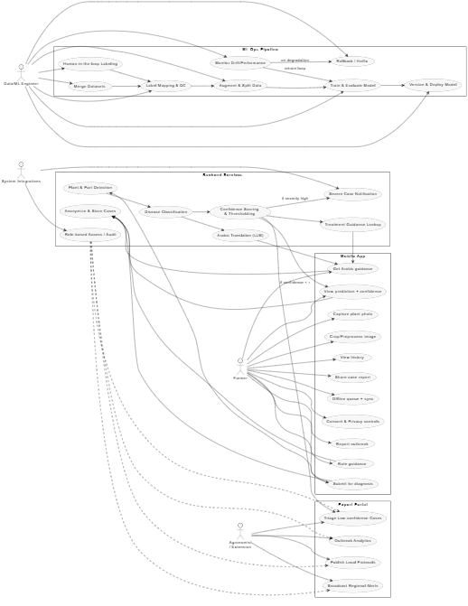

1/11/2025
######
Research & Dataset Selection
We researched publicly available datasets of plant diseases. The chosen datasets were:
Dataset	Reason for Use
vipoooool/new-plant-diseases-dataset:
Base dataset covering multiple crops and disease types. Useful for general plant disease classification.
habibulbasher01644/olive-leaf-image-dataset:
Contains images of olive leaves, including common diseases in Jordan (like Peacock Spot).
serhathoca/zeytin	Additional:
olive leaf images for better representation of olive diseases.
kushagra3204/wheat-plant-diseases:
Focused wheat plant disease dataset to include key crops cultivated in Jordan.
Why classification and not object detection:
Object detection identifies and localizes multiple objects in an image, which is more complex and resource-intensive.
Our goal is to classify images of leaves by disease type, which is simpler and sufficient for early detection and decision-making in agriculture.
Classification allows faster model training and easier integration into mobile/field apps for farmers.
######
Dataset Download
Kaggle datasets were downloaded using the Kaggle CLI.
Any other datasets (URLs) were downloaded using urllib.
Archives (.zip, .tar, .tgz) were extracted automatically.
Olive Leaf Image Dataset — https://www.kaggle.com/datasets/habibulbasher01644/olive-leaf-image-dataset
kaggle.com

Olive Leaf Disease Dataset (Zeytin) — https://www.kaggle.com/datasets/serhathoca/zeytin
kaggle.com

Wheat Plant Diseases — https://www.kaggle.com/datasets/kushagra3204/wheat-plant-diseases
kaggle.com

20k+ Multi‑Class Crop Disease Images — https://www.kaggle.com/datasets/jawadali1045/20k-multi-class-crop-disease-images

Main dataset: https://www.kaggle.com/datasets/vipoooool/new-plant-diseases-dataset?utm_source=chatgpt.com
#####
7-8 NOV

NEW STRUCTURE OF THE DATASET 
jordan_dataset/
├── train/
│   ├── Apple/
│   │   ├── Apple_scab/
│   │   └── healthy/
│   ├── Olive/
│   │   ├── Peacock_spot/
│   │   └── healthy/
│   ├── Wheat/
│   │   ├── Leaf_rust/
│   │   └── healthy/
├── test/
│   ├── Apple/
│   │   ├── Apple_scab/
│   │   └── healthy/
│   ├── Olive/
│   │   ├── Peacock_spot/
│   │   └── healthy/
│   ├── Wheat/
│   │   ├── Leaf_rust/
│   │   └── healthy/
├── valid/
│   ├── Apple/
│   │   ├── Apple_scab/
│   │   └── healthy/
│   ├── Olive/
│   │   ├── Peacock_spot/
│   │   └── healthy/
│   ├── Wheat/
│   │   ├── Leaf_rust/
│   │   └── healthy/

####3 these were used in the code to help us merge the datasets and seprate them for training testing and validation 
├── metadata.csv
├── metadata_train.csv
├── metadata_val.csv
├── metadata_test.csv
└── class_counts.csv

#######
in the code we added data Augmentation (manipulation) for classes who got less than 500 images.
we used RandomRotate90(), Flip(), Transpose(), RandomBrightnessContrast(), ShiftScaleRotate()
####
11 NOV

Made a uml diagram using PlantUML

This was only a test

####
8 Mar

Ran an mlflow experiment for online models and offline models.
online models:
resnet_50
efficientnet_b0

offline models:
mobilenet_v3_small
mobilenet_v3_large
efficientnet_b0

all with:
    batch_size: 2
    learning_rate: 0.001
    epochs: 5
    image_size: 224

results:
=== ONLINE MODELS ===
Best run: efficientnet_b0_224
Model: efficientnet_b0
Overall score: 0.9500
Test accuracy: 0.7401
Test mIoU: 0.3367
Parameters: 4065193
Model size (MB): 15.80
Training time (sec): 3907.87

--- ONLINE MODELS: Special Awards ---
Best accuracy: efficientnet_b0_224 (0.7401)
Best mIoU: efficientnet_b0_224 (0.3367)
Most parameter-efficient: efficientnet_b0_224 (4065193)
Smallest model: efficientnet_b0_224 (15.80 MB)
Fastest training: resnet50_224 (3488.22 sec)

=== OFFLINE MODELS ===
Best run: mobilenet_v3_small_224
Model: mobilenet_v3_small
Overall score: 0.9896
Test accuracy: 0.7287
Test mIoU: 0.2896
Parameters: 1563981
Model size (MB): 6.10
Training time (sec): 2598.00

--- OFFLINE MODELS: Special Awards ---
Best accuracy: mobilenet_v3_small_224 (0.7287)
Best mIoU: efficientnet_b0_224 (0.2909)
Most parameter-efficient: mobilenet_v3_small_224 (1563981)
Smallest model: mobilenet_v3_small_224 (6.10 MB)
Fastest training: mobilenet_v3_small_224 (2598.00 sec)

Top ONLINE ranking:
 rank            run_name      model_name  test_acc  test_miou  num_parameters  model_size_mb  overall_score
    1 efficientnet_b0_224 efficientnet_b0  0.740114   0.336728       4065193.0      15.795885           0.95
    2        resnet50_224        resnet50  0.631634   0.240571      23600237.0      90.332159           0.05

Top OFFLINE ranking:
 rank               run_name         model_name  test_acc  test_miou  num_parameters  model_size_mb  overall_score
    1 mobilenet_v3_small_224 mobilenet_v3_small  0.728668   0.289563       1563981.0       6.097002       0.989630
    2    efficientnet_b0_224    efficientnet_b0  0.706296   0.290867       4065193.0      15.795885       0.329988
    3 mobilenet_v3_large_224 mobilenet_v3_large  0.686785   0.265718       4259677.0      16.449530       0.120748

notes: Online model choice based on this is 'efficientnet_b0' and Offline model choice based on this is 'mobilenet_v3_small', but this is due to small number of epochs in resnet50 that the result it gave was efficientnet_b0.

Next I will increase epochs but keep an early stop in place to the values bellow:

    ResNet50: 40
    EfficientNet-B0: 30
    MobileNetV3 Small: 25
    MobileNetV3 Large: 30

patience: 5
min_delta: 0.001
batch_size: 4

####
9 Mar

Results of training for more epochs letting early stop finish the training with the following:
    ResNet50: 40
    EfficientNet-B0: 30
    MobileNetV3 Small: 25
    MobileNetV3 Large: 30

patience: 5
min_delta: 0.001
batch_size: 4

The ranking stayed the same.

=== ONLINE MODELS ===
Best run: efficientnet_b0_224_epochs30
Model: efficientnet_b0
Overall score: 0.9815
Test accuracy: 0.7666
Test mIoU: 0.3442
Parameters: 4065193
Model size (MB): 15.80
Training time (sec): 3193.20

--- ONLINE MODELS: Special Awards ---
Best accuracy: efficientnet_b0_224_epochs30 (0.7666)
Best mIoU: efficientnet_b0_224_epochs30 (0.3442)
Most parameter-efficient: efficientnet_b0_224_epochs30 (4065193)
Smallest model: efficientnet_b0_224 (15.80 MB)
Fastest training: resnet50_224_epochs40 (2772.16 sec)

=== OFFLINE MODELS ===
Best run: mobilenet_v3_small_224_epochs25
Model: mobilenet_v3_small
Overall score: 0.7945
Test accuracy: 0.7638
Test mIoU: 0.3384
Parameters: 1563981
Model size (MB): 6.10
Training time (sec): 2040.09

--- OFFLINE MODELS: Special Awards ---
Best accuracy: mobilenet_v3_large_224_epochs30 (0.7901)
Best mIoU: mobilenet_v3_large_224_epochs30 (0.3891)
Most parameter-efficient: mobilenet_v3_small_224_epochs25 (1563981)
Smallest model: mobilenet_v3_small_224 (6.10 MB)
Fastest training: mobilenet_v3_small_224_epochs25 (2040.09 sec)

Top ONLINE ranking:
 rank                     run_name      model_name  test_acc  test_miou  num_parameters  model_size_mb  overall_score
    1 efficientnet_b0_224_epochs30 efficientnet_b0  0.766649   0.344221       4065193.0      15.799253       0.981464
    2        resnet50_224_epochs40        resnet50  0.753382   0.338275      23600237.0      90.335001       0.822023
    3          efficientnet_b0_224 efficientnet_b0  0.740114   0.336728       4065193.0      15.795885       0.734774
    4                 resnet50_224        resnet50  0.631634   0.240571      23600237.0      90.332159       0.018475

Top OFFLINE ranking:
 rank                        run_name         model_name  test_acc  test_miou  num_parameters  model_size_mb  overall_score
    1 mobilenet_v3_small_224_epochs25 mobilenet_v3_small  0.763788   0.338379       1563981.0       6.099131       0.794502
    2 mobilenet_v3_large_224_epochs30 mobilenet_v3_large  0.790062   0.389062       4259677.0      16.452242       0.660598
    3    efficientnet_b0_224_epochs30    efficientnet_b0  0.765609   0.347141       4065193.0      15.799253       0.559841
    4          mobilenet_v3_small_224 mobilenet_v3_small  0.728668   0.289563       1563981.0       6.097002       0.554675
    5             efficientnet_b0_224    efficientnet_b0  0.706296   0.290867       4065193.0      15.795885       0.101562
    6          mobilenet_v3_large_224 mobilenet_v3_large  0.686785   0.265718       4259677.0      16.449530       0.073020

####